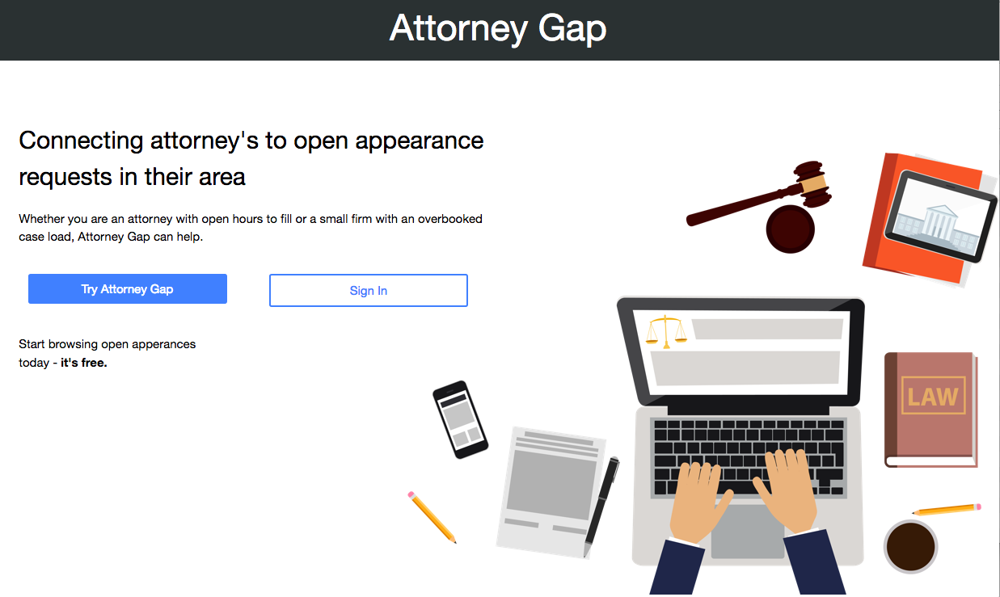
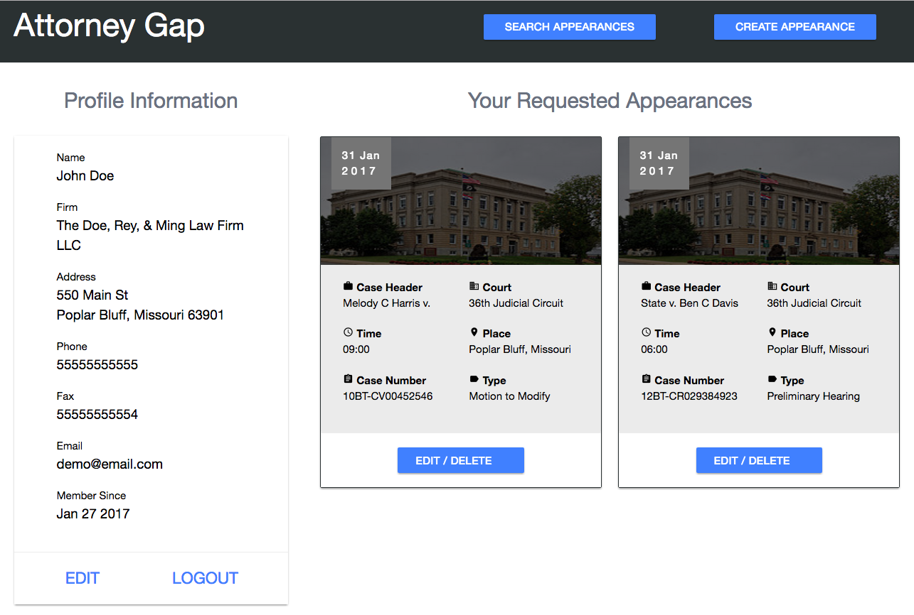

# [Attorney Gap](https://attorney-gap.herokuapp.com/)

Attorney Gap provides a platform for attorneys to both post appearances they need another attorney to cover or find information about available appearances 

# Overview

Navigating the needs of a user's clients with the availability of the court system can create all kinds of scheduling conflicts. Sometimes, the only available date for trial in the next three months falls on the same day the an attorney already three appearances scheduled in another county. That is where Attorney Gap comes in. Not only does assist the attorney who has a conflict, but it also creates an opportunity for other attorneys to pick up some extra billable hours. 

# Technical

The front-end utilizes EJS and is styled with Materialize. The Backend is built with NodeJS using an ExpressJS web server and a MongoDB database.

# UX

When upon visiting the app, the user is asked to sign in or signup.

After signing in or signing up, User is directed to their homepage. From here, the User is shown their profile information as well as a list of the appearances they have requested to be covered. Each of the appearances are displayed on a card that can be clicked on to reveal more information. The User also has the option to edit or delete the appearance. 

From the user's main page, they have the option to create a new appearance.

The User may also search for available appearances by clicking 'Search Appearances' button, which will take them to a different page where they can select the State and County to display available appearances.  

# Development Roadmap

Future enhancements:

* provide authentication of attorney users
  * authentication of email
  * authentication of bar license standing 

* enhance appearance information
  * allow user to include notes about a hearing

* messaging between users
  * allow users to directly send messages to other users
  * allow users to email other users